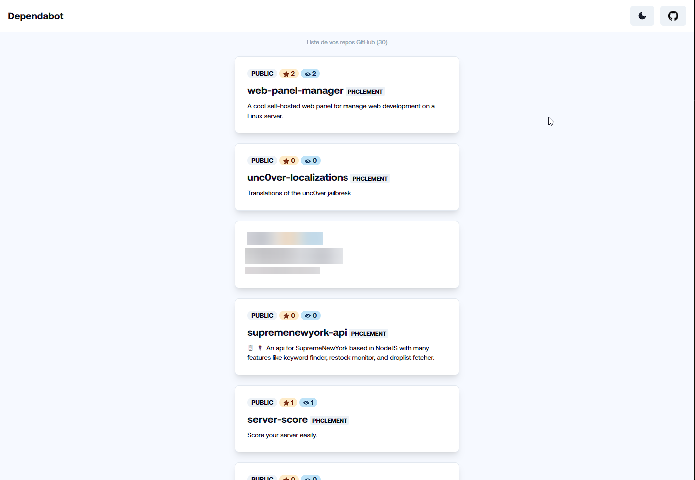

# Dependabot

     

# Sujet
## But :

* Realiser un Un Robot de mise a jours des dépendances maven et NPM

## Participants Groupe 1 :
- DE LOUVENCOURT Clement
- COLICHE Haris

## Fonctionnalitées :

Le Robot surveille regulierement un repository
Quand il detecte qu'une dependance peut être mis a jours, il créer une pull request avec seulement ce changement

## Critères dévaluations :

Toute les fonctionnalités sont présentes
Les contraintes techniques sont respectée
Le code est propre et les responsabilités sont correctement distribuées
La couverture de test du code java dépasse 50%
L'application est deployé via le docker-compose partagé de la classe.
L'application est polie et prête a être lancée.